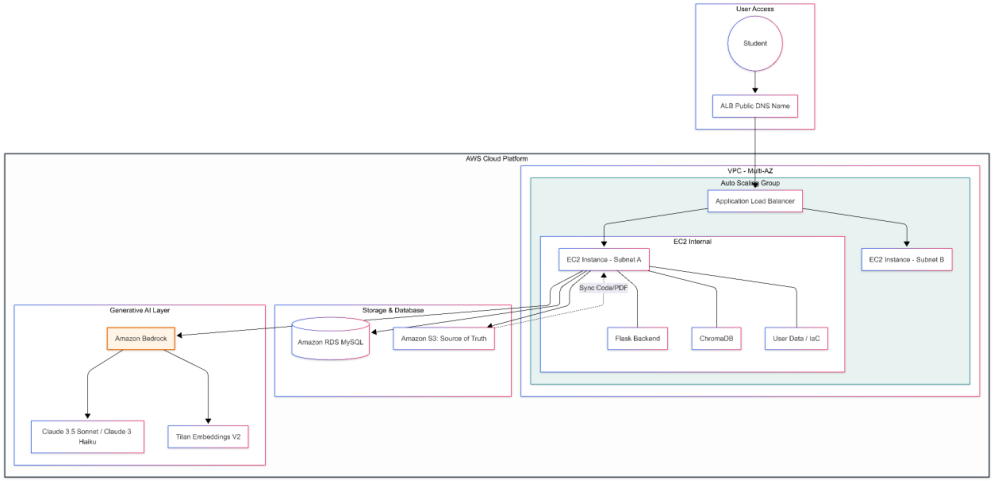
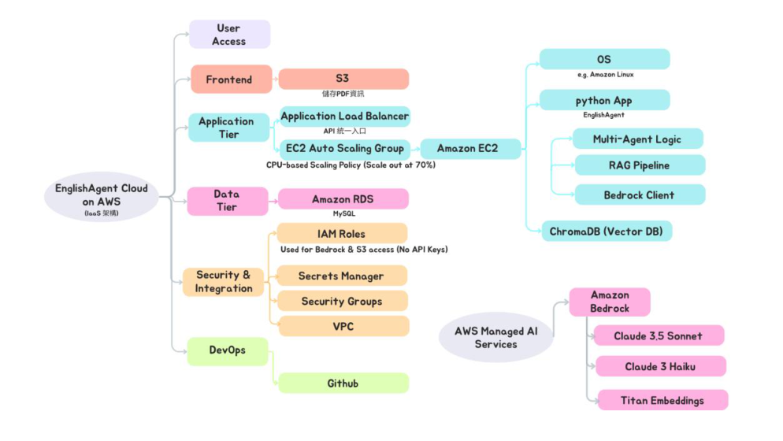
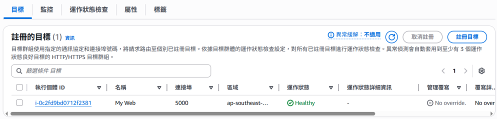
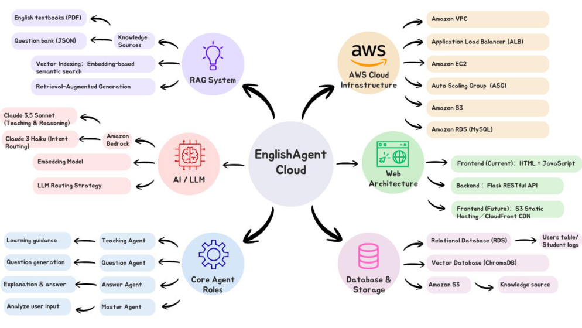
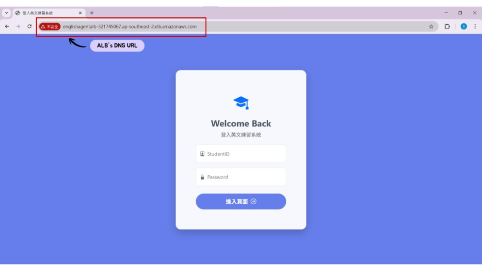
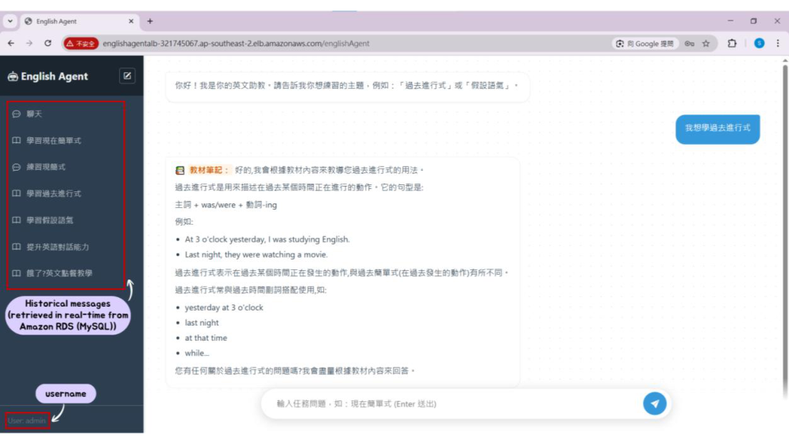
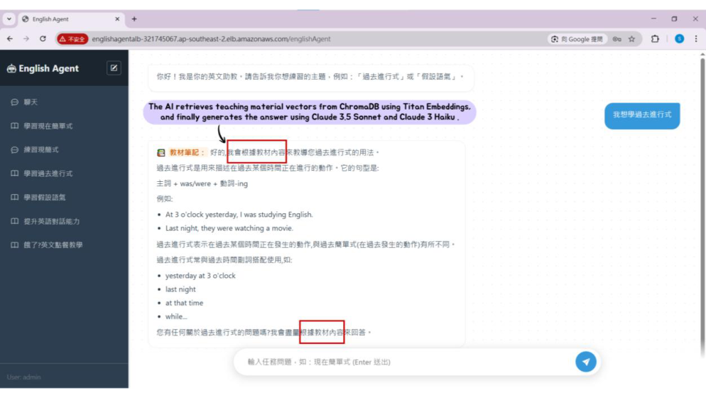

# EnglishAgent 專案報告

> EnglishAgent 是一個整合 AWS、AI 與 RAG 的英文學習平台。
> 本專案結合雲端部署、知識庫檢索與多代理流程，提供可互動的英文教學與問答體驗。

## 1. 專案簡介

EnglishAgent 的核心目標，是把英文學習、教材查詢、對話式回覆與雲端服務整合到同一個平台中。  
使用者可以透過網頁登入後進入聊天介面，向系統提出英文學習問題，系統會依照問題內容啟動對應的 AI / RAG 流程，從 PDF 教材與知識庫中檢索資訊，再產生有教學脈絡的回覆。

這個專案同時展示了：

- AWS 雲端基礎架構的設計
- AI 模型與 RAG 的整合方式
- Flask 後端與網頁前端的串接
- 使用 RDS、S3、ChromaDB、Bedrock 建立完整的應用流程

## 2. 專案目標

| 項目 | 說明 |
|---|---|
| 雲端化部署 | 以 AWS 建立穩定、可擴充、可維運的服務環境。 |
| AI 教學 | 提供可互動的英文學習與問答體驗。 |
| 知識整合 | 將 PDF 教材與專案知識轉為可檢索資料。 |
| 高可用架構 | 使用 ALB、ASG、RDS 與 VPC 提升服務穩定性。 |
| 模組化設計 | 讓前端、後端、知識庫與模型推論可以獨立演進。 |

## 3. 雲端架構

### 3.1 架構概觀

EnglishAgent 的雲端架構可分成五個主要層次：

1. 使用者存取層
2. 前端與應用層
3. AI / RAG 推論層
4. 資料與儲存層
5. 安全與維運層

整體資料流為：

```text
User -> ALB -> EC2 / Flask Backend -> Master Agent -> RAG / Bedrock -> Response -> RDS / Logs
```

### 3.2 使用者存取層

使用者會先透過 Application Load Balancer 的 DNS URL 進入系統。  
登入頁直接對外提供存取入口，代表實際服務是透過 ALB 做公開暴露，而不是直接將 EC2 對外開放。

這樣做的好處是：

- 將外部流量集中到單一入口
- 方便未來切換後端實例
- 提升安全性與維護彈性
- 可以搭配憑證與健康檢查機制

### 3.3 雲端架構圖



這張圖是整體架構總覽，可以看到使用者先經過 ALB 進入系統，流量再進到 VPC 內的 EC2 與 Flask 後端。  
圖中也標示了 Bedrock、S3、RDS 與 ChromaDB 的關係，說明 EnglishAgent 不是單一聊天頁面，而是一套完整的雲端應用：

- 前端負責接收操作
- 後端負責流程控制
- Bedrock 負責 AI 推理
- S3 提供教材來源
- RDS 儲存狀態與歷史
- ChromaDB 支援 RAG 檢索

### 3.4 雲端堆疊圖



這張圖把系統拆成幾個層級來看：

- User Access
- Frontend
- Application Tier
- Data Tier
- Security & Integration
- DevOps

它特別說明了：

- 前端目前是 HTML + JavaScript
- 後端是 Flask RESTful API
- S3 可作為靜態資源與教材儲存位置
- ALB 是 API 的統一入口
- ASG 會依 CPU 或負載進行擴縮
- RDS 作為結構化資料儲存
- IAM、Security Group、VPC、Secrets Manager 負責安全與整合

## 4. 架構元件說明

| 元件 | 說明 |
|---|---|
| Amazon EC2 | 執行 Flask 後端、AI 邏輯與 API 服務。 |
| Application Load Balancer | 接收外部流量並分派到健康的 EC2 實例。 |
| Auto Scaling Group | 根據負載擴縮 EC2，提升可用性。 |
| Amazon VPC | 隔離公私網路並控制子網與路由。 |
| Amazon S3 | 存放 PDF 教材與專案資源。 |
| Amazon RDS (MySQL) | 保存使用者資料、聊天紀錄與系統資訊。 |
| ChromaDB | 儲存教材向量，支援語意檢索。 |
| Amazon Bedrock | 提供 Claude 與 Titan 等模型能力。 |
| IAM / Security Group | 控制 AWS 資源權限與網路存取。 |
| Secrets Manager | 儲存敏感設定，避免硬編碼。 |

### 4.1 圖說補充



這張圖是 AWS 負載平衡與健康檢查畫面，顯示目標群組中的實例狀態為 Healthy，代表部署具備可用性與容錯能力。  
它說明 EnglishAgent 不是單機部署，而是採用可擴充、可監控的方式運作。搭配 Multi-AZ 或 ASG 設計後，當某一台 EC2 故障時，流量可以自動導向其他健康節點。



這張圖整理了 EnglishAgent Cloud 的完整概念，從 AWS、Web、Database、Core Agent、AI 與 RAG 六個方向收斂整個專案。  
它很適合作為專案總結圖，因為把整個系統的範圍一次收斂清楚。

## 5. 資料流程

### 5.1 使用者進入系統

1. 使用者打開 ALB 的 DNS 網址。
2. 進入登入頁面，輸入帳號密碼。
3. 驗證完成後，導向聊天主頁。

### 5.2 登入與聊天畫面



這是系統的入口頁，使用者透過 ALB 的 DNS URL 進入登入介面，輸入 StudentID 與 Password 後再進入主系統。  
它代表服務是透過雲端公開入口提供，而不是直接把後端裸露在外。



這張圖展示 EnglishAgent 的主要互動介面，包含功能選單、對話區與輸入框，並顯示歷史訊息由 RDS 讀取。  
它說明前端只是入口，真正的互動資料與歷史狀態會回到後端與資料庫管理。

### 5.3 互動與推論流程

1. 使用者輸入英文學習需求或問題。
2. Flask 後端接收請求並解析意圖。
3. Master Agent 決定是否需要查詢知識庫。
4. 若需要檢索，系統會將查詢向量化。
5. ChromaDB 找出與問題最相關的教材片段。
6. Bedrock 上的 LLM 根據檢索結果產生回答。
7. 回答與學習歷程寫回 RDS。

```text
User
  -> ALB
  -> EC2 / Flask
  -> Master Agent
  -> RAG / Bedrock
  -> Response
  -> RDS / Logs
```

## 6. Agent 與 AI 設計

### 6.1 Agent 設計理念

EnglishAgent 採用 Master-Sub Agent 的概念，讓不同任務由不同角色處理：

- Master Agent：理解使用者目標、決定流程
- Question Agent：整理問題與意圖
- Teaching Agent：產生教學內容
- Answer Agent：生成最終回答

這種方式的優點是：

- 邏輯清楚
- 每個 agent 負責單一職責
- 容易擴充更多教學功能
- 可以降低單一 prompt 過長造成的不穩定

### 6.2 模型使用方式

| 模型 / 機制 | 用途 |
|---|---|
| Claude 3.5 Sonnet | 複雜推理、教學整理、較高品質的回覆。 |
| Claude 3 Haiku | 快速反應、輕量分類與簡單回答。 |
| Titan Embeddings V2 | 產生向量，用於語意檢索。 |
| RAG | 從教材中找出相關段落作為回答依據。 |
| Chain-of-Thought | 協助模型在內部整理推理路徑。 |

## 7. RAG 與知識庫

### 7.1 知識來源

EnglishAgent 的知識來源主要包含：

- 英文教材 PDF
- 題庫或學習筆記
- 系統內部的課程內容
- 對話歷程與使用者行為資料

### 7.2 RAG 流程

1. 讀取 PDF 或教材內容。
2. 將內容切塊，避免單段文字過長。
3. 透過 Titan Embeddings V2 轉成向量。
4. 存入 ChromaDB 建立索引。
5. 使用者提問時，先做語意檢索。
6. 將檢索到的內容交給 LLM 生成最終答案。

### 7.3 RAG 對話圖



這張圖說明 RAG 的實際應用，系統先從 ChromaDB 找出教材片段，再交給 Claude 生成更準確的回答。  
圖中的重點也說明了：

- Titan Embeddings 負責向量化
- ChromaDB 負責語意檢索
- Claude 3.5 Sonnet / Claude 3 Haiku 負責生成回覆

RAG 的目的不是單純讓 AI 自己回答，而是讓 AI 先參考專案知識再回答，這能提升正確性、可追溯性、教材一致性與對 PDF 文件內容的對應能力。

## 8. 系統特色與限制

| 項目 | 說明 |
|---|---|
| 優點 | 整合雲端、AI、RAG 與教材管理，結構完整。 |
| 優點 | 可用模組化方式擴充更多任務與教學功能。 |
| 優點 | 使用 AWS 元件，具備較好的可用性與維運彈性。 |
| 限制 | PDF 與知識庫需要持續更新，否則答案可能過時。 |
| 限制 | 模型回應速度會受推論與檢索流程影響。 |
| 限制 | prompt 與 agent 路由需要持續調整才能穩定。 |

## 9. 專案目錄與執行

### 9.1 常用目錄

| 目錄 | 說明 |
|---|---|
| `pages/` | 靜態網頁入口，包含 `index.html`。 |
| `assets/` | 圖片與簡報素材。 |
| `README.md` | 專案說明文件。 |

### 9.2 啟動方式

```bash
pip install -r requirements.txt
python run.py
```

### 9.3 AWS 部署提醒

- PDF 教材建議放在 Amazon S3 管理。
- ALB 是對外入口，適合掛在前面做流量分配。
- EC2 建議使用 IAM Role 來存取 AWS 服務，不要硬編碼金鑰。
- RDS 建議搭配安全群組與私有網路。
- ChromaDB 可作為 RAG 的向量資料庫。

## 10. 後續維護建議

- 定期更新教材 PDF 與向量索引。
- 監控 RDS、EC2、ALB 與 ASG 健康狀態。
- 優化 prompt 與 agent 分工，讓回答更穩定。
- 若未來流量增加，可將前端改為 S3 靜態網站或 CDN 架構。
- 持續補充更多題型、更多學習情境與更完整的回饋機制。

